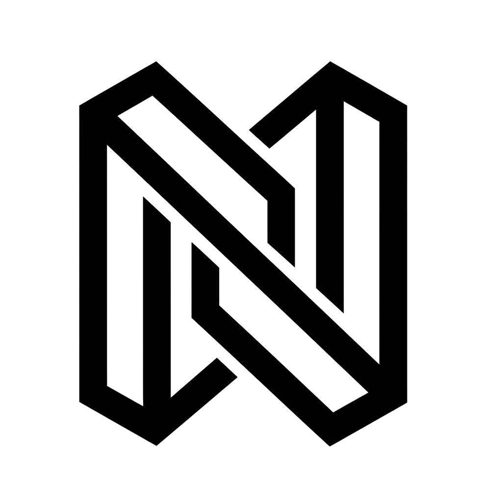

<div align="center">



# TENET · 信条

### AI 能力汇聚 · 智能极简主义 · 长期主义

<p align="center">
  <strong>信条 TENET</strong> — 你的 AI 控制中心 · 连接 · 信任 · 稳定
</p>

<p align="center">
  <a href="#"></a>
  <a href="#"></a>
  <a href="#"></a>
  <a href="#"></a>
</p>

---

> **本仓库基于 [QuantumNous/new-api](https://github.com/QuantumNous/new-api) 二次开发**，
> 在保留上游核心业务能力（认证、渠道、计费、转发、API Key 等）的前提下，
> 对前端体验层、视觉与交互设计进行了品牌化改造。
>
> 原始项目 README 请见 👉 [**README.old.md**](./README.old.md)
>（多语言：<a href="./README.zh_CN.md">中文</a> ·
> <a href="./README.en.md">English</a> ·
> <a href="./README.zh_TW.md">繁體中文</a> ·
> <a href="./README.fr.md">Français</a> ·
> <a href="./README.ja.md">日本語</a>）

---

## ✨ 项目定位

**TENET「信条」** 是一个 AI 能力汇聚平台，面向开发者的智能 API 控制中心。

- 🎨 **品牌化前端体验**：TENET 品牌视觉、暖金色背景、智能极简主义设计语言
- 🔐 **完整业务能力**：继承 New API 的认证、渠道、计费、模型转发、使用记录等核心功能
- 🧩 **UI 与业务解耦**：前端视觉改造不影响后端业务逻辑，可持续同步上游更新
- 🚀 **面向生产**：已具备生产环境部署与运营能力

## 🧭 技术栈

| 层 | 技术 |
| --- | --- |
| 后端 | Go（Gin / Echo）· SQLite · Redis |
| 前端 | React 19 · TypeScript · Tailwind CSS · Rsbuild |
| 部署 | Docker · Docker Compose |

## 📁 目录结构

| 路径 | 说明 |
| --- | --- |
| `web/` | 前端应用（React + TS + Tailwind） |
| `common/` `controller/` `model/` `relay/` `service/` | 后端核心逻辑 |
| `i18n/` | 后端多语言 |
| `docker/` | 部署相关 |

## 🚀 快速开始

### 使用 Docker（推荐）

```bash
# 拉取并运行
docker run -d --name new-api \
  -p 3000:3000 \
  -v ./data:/data \
  -e TZ=Asia/Shanghai \
  calciumion/new-api:latest

# 访问 http://localhost:3000
```

### 本地开发

```bash
# 后端
go mod download
go run main.go

# 前端
cd web
npm install
npm run dev   # 或 pnpm / bun dev
```

> 详细部署与配置请参阅 [README.old.md](./README.old.md) 原项目文档。

## 🛡️ 安全与合规

- 本仓库为公开仓库，**禁止提交任何密钥、Token、数据库与日志文件**
- 生产环境敏感配置请通过环境变量注入，切勿写入代码库

## 📄 许可证

本项目基于 **GNU Affero General Public License v3（AGPL-3.0）** 开源，
与上游 [QuantumNous/new-api](https://github.com/QuantumNous/new-api) 许可证保持一致。

- 完整许可证文本见 [LICENSE](./LICENSE)
- 上游许可证：AGPL-3.0

---

<div align="center">

**TENET · 信条** — 连接 · 信任 · 稳定 · 长期主义

</div>